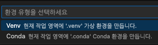

# GenAI

For GenAI

---

## Python

### 구성

- version : Python 3.9.6
- 가상환경 관리 도구 : venv

### 자료형

- 숫자
  - 정수형(int), 실수형(float), 문자열(str), 불(bool)

### 입력

- input()을 사용
- 어떤 값을 입력해도 전부 str(문자열) 취급

### 형변환

- 문자열 > 정수 : int(val)
- 문자열 > 실수 : float(val)
- 숫자(정수,실수) > 문자열 : str(val)

### True인 값, False인 값

- True
  - 1, 값이있는 문자열, 등 ...
- False
  - 0, 빈 문자열, 빈 리스트, ...

### Pass 키워드

- 일단 비워두고 추후에 작성할 라인에 쓰이는 용도
- 정말 아무것도 하지않음
- 오류 없이 넘어가는것이 사용의도

```python
if (True):
    pass
else:
    pass

```

### List란?

- 여러가지 타입을 저장할 수 있는 자료
- 문자열에서 사용하는 연산자는 리스트에도 사용 할 수 있다.
  - '+', '\*', 'len'

```python
array = [1,2,1.1,"안녕",True]
print(array)
print(type(array))

##RESULT
# [1, 2, 1.1, '안녕', True]
# <class 'list'>
```

- 리스트의 합은 두 가지 방법이 있다
  - '+'연산자를 사용하는 방식은 비파괴적(원본유지)방법
  - extend()함수를 이용하는 방식은 파괴적(원본변화)방법
    - a.extend(b)라 할 때, a = a + b 로 변화한다.
- 리스트 요소 삭제 (인덱스사용)
  - del list[idx]
  - list.pop(idx)
    - pop의 경우 idx가 생략되면 -1이 디폴트가되어 맨 마지막 요소가 삭제된다.
    - :를 사용하는 슬라이싱
    - del list[1:2]
      - 1번인덱스를 기준으로 좌측에서 두번째 요소까지 삭제
    - del list[:2]
      - 좌측에서 두번째 요소까지 전부 삭제
    - del list[1:]
      - 1번인덱스부터 오른쪽 모든 요소 삭제
- 리스트 요소 삭제 (값사용)
  - list.remove(2)
    - 첫 번째로 발견되는 2 삭제 (2를 전부삭제하려면 반복문사용)
- 리스트 요소 전부 삭제
  - list.clear()
- 반복
  - for i in range(100):
  - for num in num_list:
  - for char in "안녕하세요":

### 특이사항

##### 파이썬의 들여쓰기는 4번(=탭1번)

##### VScode - Python Extension 구성 중 확인된 사항



- venv, conda란?
- 목적
  - 파이썬 가상환경을 관리하기위한 도구
- venv
  - 파이썬 3.3버전부터 제공되는 가상환경 도구
  - 파이썬 프로젝트 간 독립된 가상 환경 구성 가능
  - 각 프로젝트 별 패키지를 별도의 가상환경에 설치하며 프로젝트 간 충돌 방지
  - 표준 라이브러리에 포함되어 있으며, 파이썬 인터프리터도 제공
- conda
  - 파이썬 패키지 관리도구인 Anaconda의 일부로 개발된 가상 환경 도구
  - 파이썬 패키지 뿐만아니라 다양한 프로그래밍 언어 패키지 관리 가능
